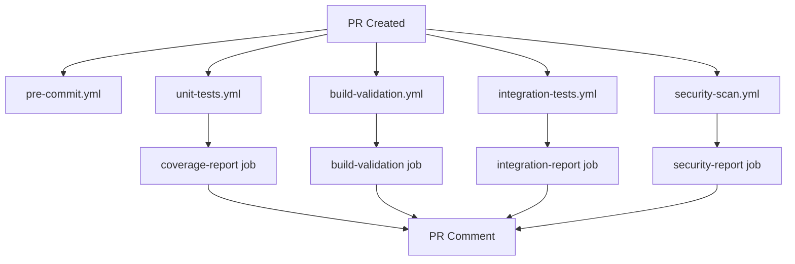

# ProjectKeystone CI/CD Workflows

This directory contains GitHub Actions workflows for automated testing, building, and security scanning of the ProjectKeystone HMAS (Hierarchical Multi-Agent System) codebase.

## Workflow Overview

### Tier 1: Fast Checks (2-5 minutes)

These workflows run on every PR and provide quick feedback:

- **pre-commit.yml** - Code formatting and linting
  - Runs pre-commit hooks (clang-format, cmake-format)
  - C++ formatting validation with clang-format-14
  - Static analysis with clang-tidy and cppcheck
  - **Triggers**: PR, push to main, manual
  - **Timeout**: 10-15 minutes

- **unit-tests.yml** - Unit test execution
  - Builds test environment in Docker
  - Runs Google Test unit tests
  - Generates coverage reports with gcovr
  - **Triggers**: PR, push to main, manual
  - **Timeout**: 15 minutes
  - **Artifacts**: Test results, coverage reports

### Tier 2: Comprehensive Checks (5-15 minutes)

These workflows provide deeper validation:

- **build-validation.yml** - Docker build verification
  - Builds all Docker stages (builder, runtime, development)
  - Validates native CMake builds
  - Runs smoke tests
  - **Triggers**: PR, push to main, manual
  - **Timeout**: 20 minutes
  - **Artifacts**: Build manifests, build reports

- **integration-tests.yml** - E2E test suites
  - Runs phase-specific E2E tests (Phase 1-4)
  - Tests full agent hierarchy delegation
  - Matrix strategy for parallel execution
  - **Triggers**: PR, push to main, manual
  - **Timeout**: 20 minutes
  - **Artifacts**: Test results, integration reports

- **security-scan.yml** - Security vulnerability scanning
  - Secret detection with Gitleaks
  - SAST scanning with Semgrep
  - CodeQL analysis for C++
  - Dependency and supply chain scanning
  - **Triggers**: PR, push to main, weekly schedule, manual
  - **Timeout**: 15-20 minutes
  - **Artifacts**: Security reports, SARIF files

## Workflow Details

### Pre-commit Checks

```yaml
File: pre-commit.yml
Jobs:
  - pre-commit: Runs all pre-commit hooks
  - formatting: Validates C++ code formatting
  - linting: Runs cppcheck and clang-tidy
```

**Key Features**:
- Caches pre-commit environments for faster runs
- Shows diff on failure for easy fixes
- Provides clear instructions for local fixes

**Local Fix Process**:
```bash
pip install pre-commit
pre-commit install
pre-commit run --all-files
git add .
git commit -m "fix: Apply pre-commit fixes"
```

### Unit Tests

```yaml
File: unit-tests.yml
Jobs:
  - test-cpp: Builds and runs Google Test suites
  - coverage-report: Generates coverage reports and PR comments
```

**Key Features**:
- Docker-based builds for consistency
- Coverage tracking with gcovr
- XML and HTML coverage reports
- Automatic PR comment updates
- Graceful handling of missing tests during development

**Coverage Requirements**:
- Target: 80% coverage (warning below)
- Celebration: 90%+ coverage
- Initial development: 0% accepted (until tests implemented)

### Build Validation

```yaml
File: build-validation.yml
Jobs:
  - build-docker: Builds Docker images (matrix: builder, runtime, development)
  - build-native: Native CMake build validation
  - build-validation: Aggregates results and reports
```

**Key Features**:
- Multi-stage Docker builds
- Native build validation
- Build artifact uploads
- PR status comments
- Fails if any build fails

**Docker Targets**:
- `builder`: Full build environment (Ubuntu 22.04, GCC 12, CMake, Ninja)
- `runtime`: Minimal runtime with test executables
- `development`: Dev tools (gdb, valgrind, clang-format)

### Integration Tests

```yaml
File: integration-tests.yml
Jobs:
  - test-integration: Runs E2E test suites (matrix: phase1-4)
  - integration-report: Aggregates results and comments PR
```

**Key Features**:
- Matrix strategy for parallel test execution
- Phase-specific E2E tests
- Fail-fast disabled (all phases run)
- Graceful handling of unimplemented phases
- Detailed PR comments with phase status

**Test Phases**:
- Phase 1: L0 ↔ L3 (Basic delegation)
- Phase 2: L0 ↔ L2 ↔ L3 (Coordination)
- Phase 3: L0 ↔ L1 ↔ L2 ↔ L3 (Full hierarchy)
- Phase 4: Multi-component parallel execution

### Security Scanning

```yaml
File: security-scan.yml
Jobs:
  - secret-scanning: Gitleaks for exposed secrets
  - sast-scanning: Semgrep static analysis
  - codeql-analysis: GitHub CodeQL for C++
  - dependency-scanning: Third-party dependency checks
  - cpp-static-analysis: Cppcheck security analysis
  - security-report: Aggregates findings and reports
```

**Key Features**:
- Multi-layered security scanning
- SARIF uploads to GitHub Security tab
- Weekly scheduled scans
- Supply chain security validation
- Blocks merges on critical vulnerabilities

**Security Tools**:
- **Gitleaks**: Secret detection in git history
- **Semgrep**: Pattern-based SAST for C++/Docker/CMake
- **CodeQL**: Deep semantic analysis for C++
- **Cppcheck**: C++ static analysis for security issues

## Workflow Triggers

### Pull Requests
All workflows run on:
- PR opened
- PR synchronized (new commits)
- PR reopened

### Push Events
All workflows run on pushes to `main` branch

### Scheduled
- **security-scan.yml**: Weekly on Mondays at 9 AM UTC

### Manual
All workflows support `workflow_dispatch` for manual triggering

## Artifacts and Retention

| Artifact | Retention | Size | Description |
|----------|-----------|------|-------------|
| Unit test results | 7 days | ~1 MB | JUnit XML test results |
| Coverage reports | 7 days | ~5 MB | HTML and XML coverage |
| Build manifests | 7 days | <1 MB | Build metadata |
| Integration reports | 30 days | ~2 MB | E2E test results |
| Security reports | 90 days | ~10 MB | SARIF and scan results |

## PR Comment Integration

All workflows post automated comments to PRs with results:

- **Unit Tests**: Coverage summary and test status
- **Build Validation**: Build status for all targets
- **Integration Tests**: Phase-by-phase status table
- **Security Scanning**: Security findings summary

Comments are updated (not duplicated) on subsequent runs.

## Workflow Dependencies



## Typical PR Timeline

```
0:00 - PR created
0:01 - Pre-commit checks start
0:02 - Unit tests start (parallel with pre-commit)
0:03 - Build validation starts (parallel)
0:05 - Integration tests start (parallel)
0:05 - Security scans start (parallel)
0:10 - Pre-commit finishes ✅
0:12 - Unit tests finish ✅
0:15 - Build validation finishes ✅
0:20 - Integration tests finish ✅
0:20 - Security scans finish ✅
0:21 - All checks complete, ready for review
```

Total time: ~20 minutes for comprehensive validation

## Failure Handling

### Pre-commit Failures
- Shows diff of formatting issues
- Provides local fix instructions
- Fails workflow

### Unit Test Failures
- Uploads test results as artifacts
- Comments PR with failure details
- Fails workflow

### Build Failures
- Reports which target failed
- Uploads build logs
- Fails workflow immediately

### Integration Test Failures
- Continues running all phases (fail-fast: false)
- Reports which phases failed
- Fails workflow after all tests run

### Security Scan Failures
- Uploads findings to Security tab
- Comments PR with summary
- Fails workflow only on critical issues

## Skipping Workflows

To skip CI workflows on a commit:
```bash
git commit -m "docs: Update README [skip ci]"
```

Note: This skips ALL workflows. Use sparingly and only for documentation changes.

## Local Development

### Running Pre-commit Locally
```bash
# Install
pip install pre-commit
pre-commit install

# Run all hooks
pre-commit run --all-files

# Run specific hook
pre-commit run clang-format --all-files
```

### Running Tests Locally
```bash
# Build and run tests in Docker
docker-compose up test

# Or in development container
docker-compose up -d dev
docker-compose exec dev bash
cd build && ctest --output-on-failure
```

### Running Builds Locally
```bash
# Build specific Docker target
docker build --target builder -t projectkeystone:builder .
docker build --target runtime -t projectkeystone:runtime .
docker build --target development -t projectkeystone:dev .

# Native build
mkdir -p build && cd build
cmake -G Ninja -DCMAKE_BUILD_TYPE=Debug ..
ninja
```

### Running Security Scans Locally
```bash
# Gitleaks
docker run -v $(pwd):/path zricethezav/gitleaks:latest detect --source /path

# Semgrep
docker run --rm -v $(pwd):/src returntocorp/semgrep semgrep --config=auto /src

# Cppcheck
cppcheck --enable=all --suppress=missingIncludeSystem -I include src/
```

## Troubleshooting

### Workflow Not Triggering
- Check branch protection rules
- Verify workflow file syntax
- Check GitHub Actions tab for errors
- Ensure repository has Actions enabled

### Docker Build Timeouts
- Increase `timeout-minutes` in workflow
- Use BuildKit caching
- Split large builds into stages

### Coverage Not Generating
- Ensure tests are built with coverage flags
- Check gcovr is installed in Docker image
- Verify test executables run successfully

### Security Scans False Positives
- Add suppressions to `.semgrepignore` or `.gitleaksignore`
- Use inline comments for cppcheck: `// cppcheck-suppress`
- Document false positives in PR comments

## Maintenance

### Weekly Tasks
- Review Dependabot PRs for GitHub Actions updates
- Check Security tab for new advisories
- Review failed scheduled security scans

### Monthly Tasks
- Update action versions (use Dependabot)
- Review artifact retention policies
- Clean up old workflow runs (automatic after 90 days)

### Quarterly Tasks
- Review and update pre-commit hooks
- Update Docker base images
- Review and update security scan configurations

## References

- [GitHub Actions Documentation](https://docs.github.com/en/actions)
- [Docker Build Best Practices](https://docs.docker.com/develop/dev-best-practices/)
- [Google Test Documentation](https://google.github.io/googletest/)
- [Semgrep Rules](https://semgrep.dev/r)
- [CodeQL C++ Queries](https://codeql.github.com/codeql-query-help/cpp/)

## Contributing

When adding new workflows:

1. Follow existing naming conventions
2. Add timeout limits to all jobs
3. Upload artifacts for debugging
4. Add PR comment integration
5. Document in this README
6. Test locally before committing
7. Add to CODEOWNERS for review

## Support

For workflow issues:
- Check workflow run logs in GitHub Actions tab
- Review this README for troubleshooting steps
- Open an issue with workflow run link
- Tag @mvillmow for assistance

---

**Last Updated**: 2025-11-18
**Workflow Version**: 1.0
**Project**: ProjectKeystone HMAS (C++20)
